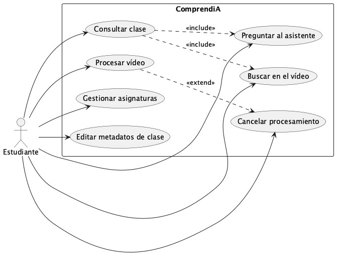
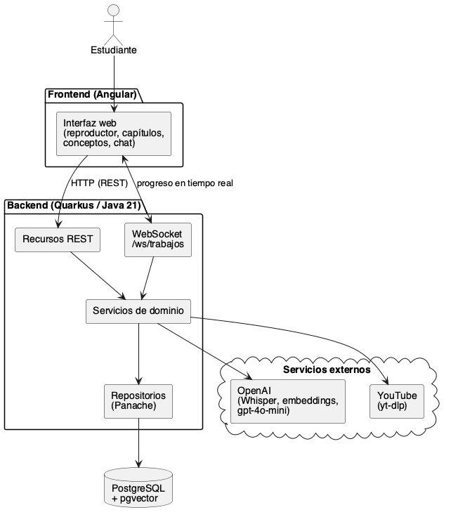
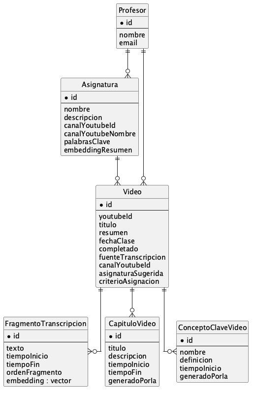
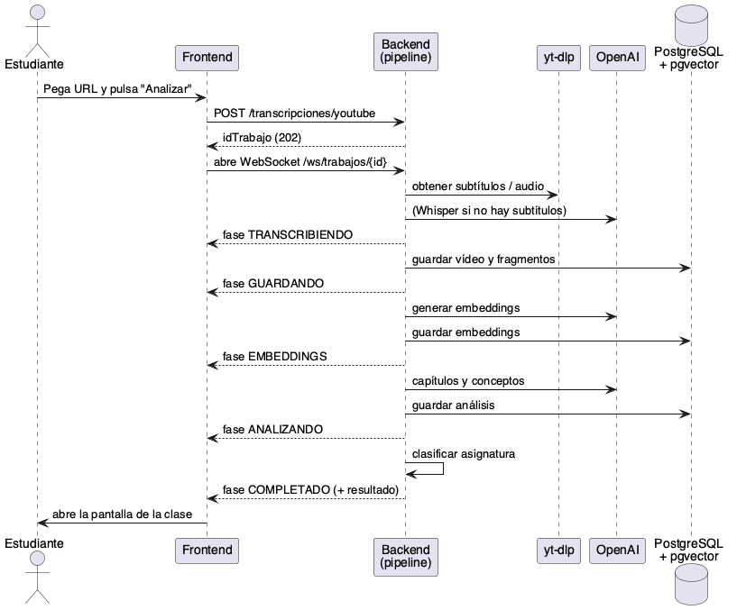
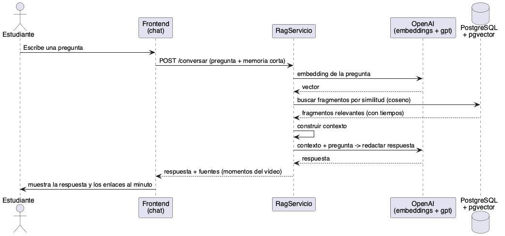

<!--
  Fuente única de la memoria del TFG (Markdown). Se exporta a Word con:
    pandoc memoria.md -o memoria.docx --toc
  Y, cuando exista la plantilla oficial en .docx:
    pandoc memoria.md -o memoria.docx --toc --reference-doc=plantilla-upsa.docx
-->

# Resumen

ComprendiA es una aplicación web educativa que transforma vídeos de YouTube en material de estudio consultable. A partir de la URL de una grabación, el sistema obtiene su transcripción —reutilizando los subtítulos de YouTube cuando existen y recurriendo al modelo Whisper en caso contrario—, la divide en fragmentos y genera un *embedding* por fragmento que permite la búsqueda semántica sobre el contenido. Sobre esa base, un proceso de análisis automático produce capítulos navegables y conceptos clave con sus marcas de tiempo, y un asistente conversacional responde preguntas del alumno mediante una arquitectura de generación aumentada por recuperación (RAG), manteniendo una memoria corta del diálogo para resolver referencias implícitas.

La aplicación organiza las clases procesadas en asignaturas. Para reducir el trabajo manual, incorpora una clasificación automática que sugiere a qué asignatura pertenece cada vídeo nuevo, primero por coincidencia de canal de YouTube y, si no la hay, por similitud semántica con las asignaturas existentes, creando una nueva cuando ninguna resulta adecuada.

El sistema se ha construido con un *backend* en Java 21 sobre Quarkus, una base de datos PostgreSQL con la extensión `pgvector` y un *frontend* en Angular. Esta memoria describe la motivación, el estado del arte de las tecnologías implicadas, la especificación de requisitos, el diseño y la implementación del sistema, las pruebas realizadas y las líneas de trabajo futuras.

# Abstract

<!-- TODO: revisar la traducción con un hablante nativo antes de la entrega. -->
ComprendiA is an educational web application that turns YouTube videos into searchable study material. Given a video URL, the system obtains its transcript —reusing YouTube subtitles when available and falling back to the Whisper model otherwise—, splits it into fragments and generates one embedding per fragment to enable semantic search over the content. On top of this, an automatic analysis produces navigable chapters and key concepts with their timestamps, and a conversational assistant answers the student's questions using a retrieval-augmented generation (RAG) architecture, keeping a short-term memory of the dialogue to resolve implicit references.

The application organises processed lectures into subjects. To reduce manual effort, it includes an automatic classifier that suggests which subject each new video belongs to, first by matching the YouTube channel and, failing that, by semantic similarity with existing subjects, creating a new one when none fits.

The system is built with a Java 21 backend on Quarkus, a PostgreSQL database with the `pgvector` extension and an Angular frontend. This document covers the motivation, the state of the art, the requirements specification, the design and implementation, the testing performed and future work.

**Descriptores:** transcripción automática, búsqueda semántica, *embeddings*, generación aumentada por recuperación (RAG), tecnología educativa.

**Keywords:** automatic transcription, semantic search, embeddings, retrieval-augmented generation (RAG), educational technology.

# Introducción

## Justificación y motivación

El vídeo se ha consolidado como uno de los principales soportes de aprendizaje. Plataformas como YouTube concentran una enorme cantidad de clases, charlas y tutoriales, pero el formato audiovisual presenta una limitación clara para el estudio: es lineal y poco consultable. Para localizar un concepto concreto dentro de una grabación de una hora, el estudiante debe recordar aproximadamente en qué momento se trató y desplazarse manualmente por la barra de reproducción. A diferencia de un texto, un vídeo no se puede buscar, ni resumir, ni hojear con facilidad.

Existen herramientas parciales —generación de subtítulos, capítulos manuales o resúmenes automáticos—, pero rara vez se integran en un único flujo pensado para el estudio. Lo habitual es que el alumno combine varias aplicaciones y siga sin poder *preguntar* directamente al contenido del vídeo.

ComprendiA nace para cubrir ese hueco: convertir cualquier vídeo de YouTube en material de estudio estructurado y consultable. La aplicación transcribe la grabación, la analiza para extraer capítulos y conceptos clave, y ofrece un asistente conversacional capaz de responder preguntas sobre el contenido citando el momento exacto del vídeo. Además, organiza las clases en asignaturas y reduce el trabajo administrativo sugiriendo automáticamente a qué asignatura pertenece cada nueva grabación.

El proyecto tiene también una dimensión social. Al permitir navegar las clases por conceptos en lugar de verlas completas, ComprendiA favorece el aprendizaje autónomo y ayuda a estudiantes con ritmos o necesidades distintas: quien necesita repasar un concepto puede ir directamente al punto donde se explica, y quien no pudo asistir a clase puede recuperar el contenido de forma más eficiente. En esa línea, el proyecto se alinea con los Objetivos de Desarrollo Sostenible relativos a la educación de calidad (ODS 4), la reducción de las desigualdades (ODS 10) y la innovación (ODS 9). Esta orientación encaja con el marco del programa TALENT, en el que se ha desarrollado el proyecto.

## Objetivos

### Objetivo general

Diseñar e implementar una aplicación web que permita transformar vídeos de YouTube en material de estudio estructurado, ofreciendo transcripción, análisis automático del contenido y consulta mediante un asistente conversacional basado en recuperación semántica.

### Objetivos específicos

- Obtener la transcripción de un vídeo de YouTube de forma eficiente, priorizando los subtítulos existentes y recurriendo a un modelo de reconocimiento del habla cuando sea necesario.
- Indexar el contenido mediante *embeddings* para permitir búsqueda semántica por fragmentos.
- Generar automáticamente capítulos navegables y conceptos clave con sus marcas de tiempo.
- Implementar un asistente conversacional (RAG) que responda preguntas sobre el vídeo con memoria corta del diálogo y referencias al momento concreto de la grabación.
- Organizar las clases en asignaturas y sugerir automáticamente la asignatura de cada vídeo nuevo mediante criterios de canal y de similitud semántica.
- Construir una interfaz web clara que integre reproductor, capítulos, conceptos y chat.

## Alcance del proyecto

El proyecto abarca el desarrollo completo de la aplicación, tanto del *backend* (API, procesamiento y persistencia) como del *frontend* (interfaz de usuario). Se contempla el procesamiento de vídeos públicos de YouTube y la gestión de clases y asignaturas por parte de un único perfil de usuario.

Quedan fuera del alcance de esta primera versión la gestión multiusuario con autenticación, el procesamiento de fuentes de vídeo distintas a YouTube y el despliegue en un entorno de producción con alta disponibilidad. Estos puntos se recogen como líneas futuras en el capítulo de conclusiones.

## Estructura de la memoria

El resto de la memoria revisa el estado del arte de las tecnologías implicadas, recoge la especificación de requisitos, describe la metodología, la arquitectura y la implementación, presenta las pruebas realizadas y sus resultados y, por último, expone las conclusiones y las líneas de trabajo futuras.

# Estado del arte

Este capítulo revisa las tecnologías sobre las que se apoya ComprendiA y las alternativas consideradas en cada caso, justificando las decisiones tomadas.

## Transcripción automática del habla

La conversión de voz a texto (*Automatic Speech Recognition*, ASR) es el primer paso del sistema. Se valoraron dos vías:

- **Subtítulos de YouTube.** Muchos vídeos disponen de subtítulos, ya sean manuales o generados automáticamente por la plataforma. Reutilizarlos evita descargar y procesar el audio, reduciendo notablemente el tiempo y el coste.
- **Whisper.** Modelo de reconocimiento del habla de OpenAI, robusto frente a ruido y con buen rendimiento multilingüe. Se emplea como alternativa cuando el vídeo no ofrece subtítulos válidos.

ComprendiA adopta una estrategia híbrida: intenta primero obtener los subtítulos mediante `yt-dlp` y solo recurre a Whisper si no existen o son de calidad insuficiente. Esta decisión prioriza el rendimiento sin renunciar a la cobertura.

La diferencia de coste entre ambas vías es notable. Obtener los subtítulos ya existentes es una operación de descarga de texto, de apenas unos segundos y sin coste de cómputo. Transcribir con Whisper, en cambio, exige descargar el audio del vídeo y ejecutar el modelo sobre toda su duración, lo que para una clase de una hora puede suponer varios minutos de procesamiento y un consumo de recursos mucho mayor. Por eso la estrategia híbrida no es solo una cuestión de comodidad, sino de eficiencia y escalabilidad: reserva el modelo pesado para los casos en que realmente no hay alternativa.

| Criterio | Subtítulos de YouTube | Whisper |
|----------|-----------------------|---------|
| Disponibilidad | Solo si el vídeo los tiene | Siempre (a partir del audio) |
| Coste de cómputo | Muy bajo (descarga de texto) | Alto (descarga de audio + inferencia) |
| Tiempo | Segundos | Minutos en vídeos largos |
| Calidad | Variable (manuales > automáticos) | Alta y homogénea |

La tabla anterior resume el compromiso. En la práctica, una proporción elevada de los vídeos educativos de YouTube dispone de subtítulos (manuales o automáticos), por lo que la mayoría de los procesamientos se resuelven por la vía rápida.

## Representación semántica: *embeddings*

Para poder buscar por significado y no solo por coincidencia de palabras, el texto se transforma en vectores numéricos (*embeddings*) que sitúan fragmentos de contenido similar cerca en el espacio vectorial. Se utiliza el modelo `text-embedding-3-small` de OpenAI por su equilibrio entre calidad y coste. La similitud entre vectores se mide con la distancia del coseno.

El almacenamiento y la consulta eficiente de estos vectores se resuelven con la extensión `pgvector` de PostgreSQL, que añade un tipo de dato vectorial y operadores de distancia indexables a una base de datos relacional convencional, evitando introducir una base de datos vectorial dedicada.

Para esta decisión se consideraron tres alternativas:

- **Bases de datos vectoriales especializadas** (Pinecone, Weaviate, Milvus). Ofrecen búsqueda vectorial a gran escala y funcionalidades avanzadas, pero añaden un servicio adicional que mantener, desplegar y sincronizar con los datos relacionales del sistema.
- **Búsqueda en memoria.** Calcular la similitud recorriendo todos los vectores en la aplicación. Es trivial de implementar, pero no escala ni persiste, y obliga a recargar todos los *embeddings* en cada arranque.
- **`pgvector` sobre PostgreSQL.** Mantiene los *embeddings* junto al resto de los datos (vídeos, fragmentos, asignaturas) en la misma base de datos, con consultas SQL e índices de similitud. No introduce infraestructura nueva.

Se eligió `pgvector` por su simplicidad operativa: el proyecto ya necesita PostgreSQL para los datos relacionales, de modo que la búsqueda semántica se resuelve sin añadir ninguna pieza extra. Esta opción es más que suficiente para el volumen de datos de la aplicación y, llegado el caso, podría migrarse a una base de datos vectorial dedicada si el número de vectores creciera de forma drástica.

La capa de inteligencia artificial se apoya en el *framework* **LangChain4j**, que proporciona abstracciones estándar para el RAG: un modelo de *embeddings* (`EmbeddingModel`), un almacén de vectores (`EmbeddingStore`) y un recuperador asociado. Para integrar el almacén con la base de datos se descartó la implementación oficial `langchain4j-pgvector` porque gestiona su propio esquema de tablas, lo que habría obligado a duplicar el almacenamiento y a **reprocesar todos los *embeddings* ya generados**. En su lugar se implementó un **adaptador propio** del `EmbeddingStore` que delega en la tabla `pgvector` ya existente: respeta la interfaz estándar de LangChain4j —y, por tanto, el resto del flujo RAG usa componentes del *framework*— pero sin reprocesar datos, sin duplicar almacenamiento y sin introducir dependencias adicionales. El vídeo sobre el que se busca se traslada como filtro de metadatos de la consulta, y los resultados se devuelven como segmentos de texto con sus marcas de tiempo. Esta decisión prioriza la continuidad de los datos y el coste cero de migración sobre el uso "de manual" de la integración oficial.

## Búsqueda semántica y generación aumentada por recuperación (RAG)

La arquitectura RAG combina la recuperación de información con la generación de lenguaje natural: ante una pregunta, primero se recuperan los fragmentos más relevantes mediante búsqueda semántica y después se entregan a un modelo de lenguaje como contexto para que redacte la respuesta. Frente al uso directo de un modelo generativo, RAG reduce las alucinaciones y ancla las respuestas en el contenido real del vídeo, además de permitir citar el momento exacto de la grabación.

El flujo RAG aplicado en ComprendiA consta de cuatro pasos:

1. **Vectorización de la pregunta.** La consulta del alumno se convierte en un *embedding* con el mismo modelo usado para indexar los fragmentos.
2. **Recuperación.** Se buscan en la base de datos los fragmentos cuyo *embedding* está más cerca del de la pregunta (distancia del coseno), obteniendo los más relevantes.
3. **Construcción del contexto.** Los fragmentos recuperados, con sus marcas de tiempo, se ensamblan en un texto de contexto.
4. **Generación.** Ese contexto y la pregunta se entregan al modelo de lenguaje, que redacta una respuesta natural citando el momento del vídeo.

La principal ventaja de este enfoque es que el modelo no responde "de memoria", sino a partir del contenido concreto de la clase, lo que aumenta la fiabilidad y permite justificar cada respuesta con una referencia temporal.

## Modelos de lenguaje generativos

Para la redacción de respuestas, la generación de resúmenes y la extracción de capítulos y conceptos se emplea `gpt-4o-mini` de OpenAI, un modelo de coste contenido y latencia razonable, suficiente para las tareas planteadas. El sistema está diseñado para degradar de forma controlada: si el modelo no está disponible, se aplican alternativas locales (por ejemplo, una segmentación por bloques temporales) para no interrumpir el procesamiento.

## Herramientas y plataformas similares

<!-- TODO: ampliar con la tabla comparativa (Monica, ScreenApp, ChatTube) de la memoria TALENT. -->
Existen soluciones que abordan partes del problema. Herramientas como Monica, ScreenApp o ChatTube permiten resumir vídeos o responder preguntas sobre contenido multimedia, pero están orientadas a uso general y no al aprendizaje académico. Ninguna integra en un único flujo la transcripción, el análisis estructurado (capítulos y conceptos), la consulta conversacional anclada en el vídeo y la organización por asignaturas.

| Herramienta | Resumen / preguntas | Navegar al minuto exacto | Capítulos y conceptos | Organización por asignaturas |
|-------------|:---:|:---:|:---:|:---:|
| Monica | Sí | Parcial | No | No |
| ScreenApp | Sí | Parcial | No | No |
| ChatTube | Sí | Parcial | No | No |
| **ComprendiA** | **Sí** | **Sí** | **Sí** | **Sí** |

Como muestra la comparativa, ComprendiA se diferencia por integrar todas estas capacidades en un único flujo orientado al estudio: no solo responde preguntas, sino que estructura la clase (capítulos y conceptos navegables), permite saltar al instante exacto donde se explica algo y agrupa las clases por asignatura. Es esa integración, y no una funcionalidad aislada, lo que constituye su aportación.

# Especificación de requisitos

Este capítulo describe qué debe hacer el sistema, con independencia de cómo se implementa. Se identifican los actores, los requisitos funcionales, los requisitos no funcionales y los casos de uso principales.

## Actores

- **Estudiante (usuario).** Único actor humano. Procesa vídeos, consulta clases, organiza asignaturas e interactúa con el asistente. En esta versión no existe gestión multiusuario, por lo que se asume un único perfil.
- **Servicios externos.** YouTube (origen del vídeo y subtítulos, vía `yt-dlp`) y la API de OpenAI (Whisper, *embeddings* y modelo de lenguaje). No son actores en el sentido clásico, pero condicionan el comportamiento del sistema.

## Requisitos funcionales

| ID | Descripción |
|----|-------------|
| RF-01 | Aceptar la URL de un vídeo de YouTube y procesarlo de forma asíncrona, informando del estado (descarga, transcripción, guardado, *embeddings*, análisis). |
| RF-02 | Obtener la transcripción reutilizando los subtítulos de YouTube si existen y recurriendo a Whisper en caso contrario. |
| RF-03 | Dividir la transcripción en fragmentos y generar un *embedding* por fragmento. |
| RF-04 | Generar automáticamente capítulos navegables y conceptos clave, cada uno con su marca de tiempo. |
| RF-05 | Reproducir el vídeo y saltar a un instante concreto desde los capítulos, conceptos o respuestas del asistente. |
| RF-06 | Permitir búsquedas semánticas sobre el contenido del vídeo. |
| RF-07 | Responder preguntas mediante RAG, manteniendo una memoria corta del diálogo para resolver referencias implícitas. |
| RF-08 | Editar los metadatos de la clase (asignatura, profesor, fecha) y marcarla como completada. |
| RF-09 | Organizar las clases en asignaturas y permitir crear, editar y eliminar asignaturas. |
| RF-10 | Al terminar el análisis, sugerir automáticamente una asignatura (por canal o por similitud semántica, creando una nueva si no hay candidata) y marcarla como sugerencia editable. |
| RF-11 | Permitir cambiar manualmente la asignatura sugerida, momento en el que deja de considerarse sugerencia. |
| RF-12 | Eliminar una clase y todos sus datos asociados. |

## Requisitos no funcionales

| ID | Descripción |
|----|-------------|
| RNF-01 | **Rendimiento.** Priorizar los subtítulos sobre Whisper; la interfaz no debe bloquearse durante el procesamiento. |
| RNF-02 | **Robustez.** Si un servicio externo falla, degradar de forma controlada sin interrumpir el procesamiento. |
| RNF-03 | **Usabilidad.** Interfaz clara, en modo oscuro, integrando reproductor, capítulos, conceptos y chat en una sola pantalla. |
| RNF-04 | **Mantenibilidad.** Todo el código (clases, métodos, variables y comentarios) en español, con separación clara entre capas. |
| RNF-05 | **Coste.** Modelos de coste contenido y reutilización de *embeddings* ya disponibles. |
| RNF-06 | **Portabilidad de datos.** *Embeddings* en PostgreSQL con `pgvector`, sin base de datos vectorial adicional. |

## Casos de uso

Los casos de uso principales son: *Procesar vídeo*, *Consultar clase*, *Preguntar al asistente*, *Buscar en el vídeo*, *Gestionar asignaturas* y *Editar metadatos de clase*. La figura siguiente los recoge.



A continuación se detallan los casos de uso principales.

**CU-01. Procesar vídeo.**

- *Actor:* Estudiante.
- *Precondición:* Disponer de la URL de un vídeo público de YouTube.
- *Flujo principal:* (1) El estudiante introduce la URL y solicita el análisis; (2) el sistema valida la URL y lanza el procesamiento asíncrono; (3) obtiene la transcripción, genera fragmentos y *embeddings*, y produce capítulos y conceptos; (4) sugiere una asignatura; (5) al completarse, se abre la pantalla de la clase.
- *Flujos alternativos:* URL no válida (se informa del error); cancelación (se eliminan los datos parciales); fallo de un servicio externo (se aplica la alternativa local).
- *Postcondición:* La clase queda persistida y consultable.

**CU-02. Consultar clase.**

- *Actor:* Estudiante.
- *Precondición:* Existe al menos una clase procesada.
- *Flujo principal:* (1) El estudiante abre una clase desde el historial o desde su asignatura; (2) el sistema carga el reproductor, los capítulos, los conceptos clave y el asistente; (3) el estudiante navega por los capítulos y salta al instante deseado.
- *Postcondición:* Ninguna (operación de solo lectura).

**CU-03. Preguntar al asistente.**

- *Actor:* Estudiante.
- *Precondición:* La clase está procesada y dispone de *embeddings*.
- *Flujo principal:* (1) El estudiante escribe una pregunta; (2) el sistema recupera los fragmentos relevantes y genera una respuesta; (3) la respuesta se muestra con enlaces al minuto exacto; (4) el estudiante puede continuar la conversación, que mantiene memoria corta del contexto.
- *Flujos alternativos:* Si no hay información suficiente, el asistente lo indica con prudencia en lugar de inventar.
- *Postcondición:* Ninguna.

**CU-04. Buscar en el vídeo.**

- *Actor:* Estudiante.
- *Flujo principal:* (1) El estudiante introduce una consulta; (2) el sistema realiza una búsqueda semántica sobre los fragmentos; (3) se devuelven los pasajes más relevantes con sus marcas de tiempo.
- *Postcondición:* Ninguna.

**CU-05. Gestionar asignaturas.**

- *Actor:* Estudiante.
- *Flujo principal:* (1) El estudiante accede a "Mis Cursos"; (2) crea, edita o elimina asignaturas; (3) el sistema persiste los cambios y actualiza la organización de las clases.
- *Flujos alternativos:* La eliminación exige confirmar escribiendo el nombre exacto de la asignatura.
- *Postcondición:* La estructura de asignaturas queda actualizada.

**CU-06. Editar metadatos de clase.**

- *Actor:* Estudiante.
- *Flujo principal:* (1) El estudiante modifica la asignatura, el profesor o la fecha de una clase, o la marca como completada; (2) el sistema persiste los cambios. Si cambia la asignatura sugerida automáticamente, esta deja de considerarse sugerencia.
- *Postcondición:* Los metadatos de la clase quedan actualizados.

# Diseño del sistema

Este capítulo describe la metodología seguida, las tecnologías empleadas y el diseño de la solución: la arquitectura general, el modelo de datos, el pipeline de procesamiento y la organización de los módulos funcionales. La realización concreta en código se aborda en el capítulo de implementación.

## Metodología

El desarrollo se ha llevado a cabo con una metodología iterativa e incremental, aplicando principios de Scrum. El trabajo se organizó en *sprints* cortos (de una a dos semanas): en cada uno se planificaban tareas concretas, se implementaban, se probaban y se revisaban con el tutor. Este enfoque permitió validar funcionalidades de forma temprana y reorientar el alcance cuando fue necesario.

Cada incremento añadió una capacidad completa y utilizable: primero la transcripción y la persistencia, después la búsqueda semántica y el asistente, más tarde el análisis automático (capítulos y conceptos), la organización por asignaturas y, por último, la clasificación automática de asignaturas.

## Tecnologías y herramientas

- **Backend:** Java 21 sobre **Quarkus**, con Hibernate ORM (Panache) para la persistencia, **WebSockets** (`quarkus-websockets-next`) para el progreso en tiempo real y ejecución del procesamiento en hilos virtuales de Java 21.
- **Base de datos:** **PostgreSQL** (en Neon) con la extensión **pgvector** para almacenar y consultar *embeddings*.
- **Frontend:** **Angular** en modo *zoneless*, con una interfaz en modo oscuro que integra reproductor, capítulos, conceptos y chat.
- **Servicios de IA (OpenAI):** `whisper` (transcripción), `text-embedding-3-small` (*embeddings*) y `gpt-4o-mini` (chat, resúmenes y análisis).
- **Obtención de vídeo:** `yt-dlp` para descargar audio, subtítulos y metadatos del canal, y `ffmpeg` para el tratamiento del audio.

## Arquitectura general

El sistema sigue una arquitectura cliente-servidor. El *frontend* Angular consume una API REST expuesta por el *backend* Quarkus. El *backend* se organiza en capas: recursos REST (`recurso`), servicios de dominio (`servicio`), repositorios de acceso a datos (`repositorio`) y entidades (`entidad`), además de objetos de transferencia (`dto`). Los servicios externos (YouTube vía `yt-dlp` y la API de OpenAI) se invocan desde la capa de servicios. La figura siguiente muestra la arquitectura general y el flujo de información entre componentes.



## Modelo de datos

Las entidades principales se resumen en la siguiente tabla; el detalle de campos se encuentra en el repositorio del proyecto.

| Entidad | Descripción y relaciones |
|---------|--------------------------|
| `Video` | Clase procesada. N–1 con `Asignatura` y `Profesor`. Guarda metadatos editables y los campos de clasificación automática. |
| `Asignatura` | Agrupa vídeos. Incluye datos para la clasificación (canal de YouTube, palabras clave y *embedding* representativo). |
| `Profesor` | Docente asociado a vídeos y asignaturas. |
| `FragmentoTranscripcion` | Fragmento de transcripción con tiempos y *embedding* (`pgvector`). Base de la búsqueda semántica. |
| `CapituloVideo` | Capítulo navegable (IA o manual) con tiempos. |
| `ConceptoClaveVideo` | Concepto clave con definición y marca de tiempo. |

Para no perder datos antiguos, los nombres de asignatura y profesor se conservan también como texto y se migran al modelo relacional al arrancar la aplicación. La figura siguiente representa el modelo de datos y sus relaciones.



## Pipeline de procesamiento asíncrono

Al solicitar el análisis de un vídeo, el *backend* responde de inmediato con un identificador de trabajo y ejecuta el procesamiento en segundo plano. El progreso se transmite al *frontend* **en tiempo real mediante WebSockets**: el cliente se conecta al canal `/ws/trabajos/{id}` y recibe cada cambio de fase según ocurre. Si la conexión WebSocket no está disponible, el sistema recurre automáticamente a un sondeo (*polling*) HTTP, de modo que la funcionalidad se mantiene en cualquier caso. La barra de progreso recorre las fases:

> DESCARGANDO → TRANSCRIBIENDO → GUARDANDO → EMBEDDINGS → ANALIZANDO → COMPLETADO

El trabajo puede terminar también como CANCELADO o ERROR. Si el usuario cancela, el sistema interrumpe el hilo y elimina los datos parciales ya guardados, dejando la base de datos en un estado consistente. La figura siguiente muestra la secuencia completa del procesamiento.



## Módulos funcionales

### Transcripción

El sistema intenta primero obtener los subtítulos del vídeo con `yt-dlp` (prefiriendo español y luego inglés). Si existen y tienen calidad suficiente, se usan directamente y se omite Whisper. En caso contrario, se descarga el audio y se transcribe con Whisper. Cada vía queda registrada en el campo `fuenteTranscripcion`.

### Indexación y búsqueda semántica

La transcripción se divide en fragmentos con sus tiempos. Para cada fragmento se genera un *embedding* que se almacena con `pgvector`. Ante una consulta, se calcula el *embedding* de la pregunta y se recuperan los fragmentos más cercanos por distancia del coseno.

### Análisis automático: capítulos y conceptos

Tras generar los *embeddings*, un servicio de análisis solicita al modelo de lenguaje la segmentación de la clase en capítulos y la extracción de conceptos clave. Para evitar que el modelo invente marcas de tiempo, los capítulos se anclan a fragmentos reales de la transcripción mediante coincidencia léxica de una frase clave, y después se normalizan temporalmente (orden, eliminación de solapamientos y ajuste de los tiempos de fin). Si el modelo falla, se aplica una segmentación local por bloques temporales para no interrumpir el procesamiento.

### Asistente conversacional (RAG)

El asistente responde preguntas sobre el vídeo combinando recuperación semántica y generación de lenguaje. Distingue entre preguntas globales (resumen, ideas principales), para las que construye contexto con el título, los capítulos, los conceptos y una muestra representativa de fragmentos, y preguntas concretas, para las que recupera los fragmentos más relevantes y cita el momento exacto del vídeo.

El chat mantiene una **memoria corta** del diálogo en el *frontend* (las últimas interacciones, sin persistencia en el servidor). Esa memoria, junto con la última entidad mencionada, se envía al *backend* para resolver referencias implícitas: por ejemplo, si el alumno pregunta "¿y el móvil?" tras hablar del "iPhone 17 Pro Max", el sistema enriquece la búsqueda con esa entidad para recuperar los fragmentos correctos.

### Organización y clasificación automática de asignaturas

Las clases se agrupan en asignaturas. Para reducir el trabajo manual, al terminar el análisis el sistema sugiere automáticamente una asignatura siguiendo este orden de decisión:

1. **Por canal de YouTube:** si ya existe una asignatura asociada al mismo canal (por identificador o por nombre normalizado), se asigna esa.
2. **Por similitud semántica:** en caso contrario, se compara el *embedding* del vídeo (título, resumen, conceptos y capítulos) con el de cada asignatura existente; si la similitud supera un umbral, se reutiliza esa asignatura.
3. **Nueva asignatura:** si ninguna resulta adecuada, se crea una nueva (por ejemplo, "Vídeos de *\<canal\>*").

En todos los casos, la asignatura se marca como **sugerencia** (metadato visual): la interfaz muestra "Asignatura: X (sugerencia)". La palabra "sugerencia" nunca forma parte del nombre real. Si el usuario cambia la asignatura a mano, deja de ser sugerencia y el sistema registra que la asignación fue manual; además, la asignatura "aprende" el canal del vídeo para clasificar mejor los siguientes.

## Diseño de la API REST

La comunicación entre *frontend* y *backend* se realiza mediante una API REST. Los *endpoints* más representativos son:

| Método | Ruta | Descripción |
|--------|------|-------------|
| POST | `/api/transcripciones/youtube` | Iniciar análisis (asíncrono). |
| GET | `/api/transcripciones/youtube/{id}` | Estado del trabajo. |
| GET | `/api/transcripciones` | Historial de clases. |
| GET | `/api/transcripciones/{id}` | Detalle de una clase. |
| PATCH | `/api/transcripciones/{id}/metadata` | Editar metadatos (asignatura, profesor…). |
| GET | `/api/transcripciones/{id}/capitulos` | Capítulos de la clase. |
| GET | `/api/transcripciones/{id}/conceptos` | Conceptos clave. |
| GET | `/api/transcripciones/{id}/buscar` | Búsqueda semántica. |
| POST | `/api/transcripciones/{id}/conversar` | Chat conversacional con memoria corta. |
| GET | `/api/asignaturas` | Listar asignaturas. |

# Implementación

Este capítulo muestra cómo se han realizado en código las decisiones de diseño descritas anteriormente. Se incluyen fragmentos representativos del proyecto —simplificados para mejorar la legibilidad— acompañados de su explicación. Todo el código está escrito en español (clases, métodos, variables y comentarios), conforme al criterio de mantenibilidad fijado en los requisitos.

## Estrategia híbrida de transcripción

El orquestador del pipeline decide entre subtítulos y Whisper. Primero intenta obtener los subtítulos del vídeo; solo si no los hay descarga el audio y llama a Whisper. El siguiente fragmento ilustra esa decisión:

```java
// Si YouTube ya tiene subtítulos válidos, se usan y se omite Whisper
var subtitulos = subtitulosYoutubeServicio.obtenerSubtitulos(idVideo);
if (subtitulos.isPresent()) {
    actualizarFase.accept(Fase.TRANSCRIBIENDO);
    return new RespuestaTranscripcionDTO(
        idVideo, titulo, subtitulos.get().fragmentos(), "YOUTUBE");
}

// Fallback: descargar audio y transcribir con Whisper
Path archivoAudio = audioExtraccionServicio.extraerAudio(idVideo);
List<FragmentoTranscripcionDTO> fragmentos =
    transcripcionAudioWhisperServicio.transcribir(archivoAudio);
return new RespuestaTranscripcionDTO(idVideo, titulo, fragmentos, "WHISPER");
```

El campo final (`"YOUTUBE"` o `"WHISPER"`) deja registrada la procedencia de la transcripción, lo que resulta útil para diagnóstico y estadísticas.

## Recuperación semántica para el asistente

Para responder una pregunta concreta, el servicio RAG vectoriza la pregunta, recupera los fragmentos más cercanos y construye con ellos el contexto que se entrega al modelo:

```java
List<Double> vectorPregunta = embeddingServicio.generarEmbedding(pregunta);
String embeddingStr = vectorPregunta.toString().replace(" ", "");
List<ResultadoBusquedaDTO> fuentes =
    fragmentoRepositorio.buscarPorSimilitud(videoId, embeddingStr, NUM_FRAGMENTOS);

String contexto = construirContexto(fuentes);          // (m:ss) texto ...
String respuesta = chatGptServicio.completar(contexto, pregunta);
return new RespuestaRagDTO(respuesta, fuentes);
```

La búsqueda por similitud se delega en la base de datos mediante `pgvector`, que ordena los fragmentos por distancia del coseno respecto al *embedding* de la pregunta y devuelve los más relevantes. La figura siguiente muestra la secuencia completa de una consulta al asistente.



## Clasificación automática de asignaturas

La decisión de qué asignatura sugerir sigue el orden canal → semántica → nueva. El método principal refleja esa cascada:

```java
// 1) Por canal de YouTube
var canal = audioExtraccionServicio.obtenerMetadatosCanal(youtubeId);
Optional<Asignatura> porCanal = buscarPorCanal(asignaturas, canal);
if (porCanal.isPresent()) {
    asignar(video, porCanal.get(), CriterioAsignacion.CANAL);
    return;
}

// 2) Por similitud semántica
List<Double> embeddingVideo = embeddingServicio.generarEmbedding(textoVideo);
for (Asignatura a : asignaturas) {
    double similitud = coseno(embeddingVideo, obtenerOcalcularEmbedding(a));
    if (similitud > mejorPuntuacion) { mejorPuntuacion = similitud; mejor = a; }
}
if (mejor != null && mejorPuntuacion >= UMBRAL_SIMILITUD) {
    asignar(video, mejor, CriterioAsignacion.SEMANTICA);
    return;
}

// 3) Crear asignatura nueva
crearAsignaturaNueva(video, idVideo, canal, embeddingVideo);
```

El método `asignar` marca la asignatura como sugerencia (`asignaturaSugerida = true`) y registra el criterio (`CANAL`, `SEMANTICA`, `MANUAL` o `NINGUNO`). Toda la lógica está envuelta en mecanismos de degradación: si la generación de *embeddings* falla, el sistema crea igualmente una asignatura nueva para no interrumpir el procesamiento.

## Progreso en tiempo real por WebSocket

El progreso del análisis se transmite por un canal WebSocket. El endpoint registra cada conexión y le envía el estado actual al abrir:

```java
@WebSocket(path = "/ws/trabajos/{idTrabajo}")
public class TrabajoWebSocket {
    @OnOpen
    public void alAbrir(WebSocketConnection conexion) {
        String idTrabajo = conexion.pathParam("idTrabajo");
        registro.registrar(idTrabajo, conexion);
        trabajoServicio.obtener(idTrabajo).ifPresent(estado ->
            conexion.sendTextAndAwait(serializar(estado)));
    }
}
```

Cada vez que el pipeline cambia de fase, el servicio de trabajos publica el nuevo estado a todas las conexiones suscritas a ese trabajo. En el cliente, si la conexión WebSocket falla o se cierra antes de terminar, se recurre automáticamente al sondeo HTTP, de modo que la funcionalidad nunca se pierde.

# Pruebas y resultados

## Pruebas automáticas

El *backend* cuenta con una batería de pruebas automáticas (JUnit y `@QuarkusTest`) que se ejecutan sin depender de servicios externos. Para ello, en el entorno de pruebas se usa una base de datos H2 en memoria y se desactivan las llamadas reales a OpenAI y a `yt-dlp` mediante propiedades de configuración. Esto permite verificar la lógica del sistema de forma rápida y reproducible. En el estado actual, la suite se compone de 19 pruebas que se ejecutan correctamente.

## Validación funcional

Además de las pruebas automáticas, se ha validado el flujo completo de forma manual: procesar un vídeo, comprobar la generación de capítulos y conceptos con marcas de tiempo coherentes, realizar preguntas al asistente (globales y concretas) y verificar los saltos al minuto exacto. También se han validado los escenarios de la clasificación automática de asignaturas:

- Vídeo de un canal ya asociado a una asignatura → se asigna por canal.
- Vídeo de un canal nuevo con temática parecida → se asigna por similitud semántica.
- Vídeo sin coincidencias → se crea una asignatura nueva.
- Cambio manual de la asignatura → desaparece la marca de "sugerencia" y persiste tras recargar.

## Medición de tiempos

Para localizar los cuellos de botella del procesamiento, la clasificación automática registra el tiempo de cada fase (obtención de metadatos del canal, coincidencia por canal, generación del *embedding* del vídeo, carga o generación de *embeddings* de asignaturas, cálculo de similitud y asociación final). Estas medidas permiten decidir dónde optimizar antes de modificar la lógica.

<!-- TODO: incluir tabla/gráfico con tiempos reales medidos. -->

## Discusión de resultados

Los resultados confirman que el sistema cumple los objetivos planteados. Las principales fuentes de latencia son las llamadas a servicios externos (descarga con `yt-dlp` y peticiones a OpenAI), lo que orienta el trabajo futuro hacia su optimización.

# Conclusiones y líneas futuras

## Conclusiones

El proyecto ha alcanzado su objetivo general: se ha diseñado e implementado una aplicación web que transforma vídeos de YouTube en material de estudio estructurado y consultable. Repasando los objetivos específicos: se obtiene la transcripción de forma eficiente; el contenido se indexa mediante *embeddings*; se generan capítulos y conceptos con marcas de tiempo coherentes; el asistente responde con memoria corta del diálogo y referencias al minuto exacto; las clases se organizan en asignaturas con sugerencia automática; y la interfaz integra reproductor, capítulos, conceptos y chat en una sola pantalla.

Más allá del cumplimiento de los requisitos, el trabajo me ha permitido integrar en un sistema real un conjunto de tecnologías actuales —transcripción automática, *embeddings*, búsqueda semántica y modelos de lenguaje— y enfrentarme a problemas propios de la ingeniería del software, como el procesamiento asíncrono, la degradación controlada ante fallos de servicios externos y la consistencia de los datos.

El sistema ha evolucionado además hacia una arquitectura más sólida y alineada con las propuestas técnicas de referencia: la capa de inteligencia artificial se migró al *framework* **LangChain4j** (modelo de *embeddings*, modelos de chat y almacén de vectores con sus abstracciones estándar sobre `pgvector`); el asistente pasó a responder **en tiempo real por WebSocket con *streaming*** token a token; se incorporó **soporte multi-modelo** en el chat (OpenAI y Google Gemini, seleccionable por el usuario, manteniendo los *embeddings* fijos para no invalidar la búsqueda); y se añadió la posibilidad de adjuntar **documentos del curso** (PDF, Word, presentaciones) a cada clase, de modo que el asistente combina la transcripción del vídeo con esos materiales para responder.

**Orientación social.** ComprendiA contribuye a un acceso más equitativo al conocimiento: permite navegar las clases por conceptos en lugar de verlas completas, favorece el aprendizaje autónomo y ayuda a estudiantes con ritmos o necesidades distintas. En este sentido, el proyecto se alinea con los Objetivos de Desarrollo Sostenible relativos a la educación de calidad (ODS 4), la reducción de las desigualdades (ODS 10) y la innovación (ODS 9).

## Líneas futuras

Durante el desarrollo se han identificado varias mejoras que, por alcance, riesgo o por aportar
escaso valor al usuario final frente al coste de implementarlas, se documentan como trabajo futuro.
Esta delimitación forma parte del propio ejercicio de ingeniería: priorizar lo que aporta valor real
sobre lo que solo añade complejidad.

- **Interoperabilidad mediante el Protocolo MCP (*Model Context Protocol*).** MCP es un estándar
  abierto que uniformiza cómo un modelo de lenguaje se conecta a herramientas y datos externos. Abre
  dos vías: que ComprendiA actúe como *cliente* MCP (el asistente usaría herramientas externas, por
  ejemplo una calculadora exacta o un buscador) o como *servidor* MCP (exponer la búsqueda en las
  clases para que cualquier IA compatible —como Claude Desktop— la consulte). Se ha pospuesto porque
  aporta un valor escaso al alumno que usa la aplicación web (es sobre todo una capa de
  interoperabilidad), mientras que su integración añade complejidad de *tool-calling* y dependencias
  adicionales. Se considera una evolución natural una vez consolidada la base actual.
- **OCR de documentos escaneados.** La extracción de texto de los documentos del curso usa Apache
  Tika, que recupera el texto digital del documento pero no reconoce imágenes. Los PDF escaneados
  (fotografías de hojas) quedan, por tanto, fuera de alcance. Integrar un motor de OCR (Tesseract en
  local o Amazon Textract como servicio gestionado) permitiría indexar también ese tipo de material.
- **Documentos a nivel de asignatura y chat de asignatura.** Actualmente los documentos se asocian a
  una clase concreta y el asistente responde por clase. Una extensión natural es permitir documentos
  a nivel de asignatura (temario, formularios, bibliografía común) y un asistente que responda
  combinando todas las clases y documentos de una misma asignatura.
- **Citar el documento como fuente en el chat.** Los extractos de documentos ya se usan como contexto
  y el modelo puede mencionar su nombre, pero —a diferencia de los fragmentos de vídeo, que enlazan al
  minuto exacto— no se muestran todavía como una "fuente" navegable en la interfaz.
- **Integración con plataformas educativas (LMS).** Conectar ComprendiA con Moodle, Blackboard u otros
  sistemas para procesar directamente las clases del entorno universitario.
- **Gestión multiusuario.** Añadir autenticación y perfiles para soportar varios estudiantes y
  profesores.
- **Optimización del procesamiento.** Reducir la latencia de las llamadas externas (reutilizar la
  consulta de `yt-dlp`, cachear *embeddings* de asignaturas, paralelizar fases) a partir de los
  tiempos medidos.
- **Mejora de la clasificación.** Umbral de similitud configurable, sugerencia también del profesor y
  refinamiento del aprendizaje del canal.
- **Reproductor enriquecido.** Marcar sobre la barra de progreso los capítulos y fragmentos
  analizados, sincronizando la posición del vídeo con la transcripción.

# Anexo A. Manual de instalación y uso

Este anexo resume cómo instalar, arrancar y utilizar ComprendiA. La información detallada y actualizada se encuentra en el fichero `README.md` del repositorio.

**Requisitos previos:** `yt-dlp` y `ffmpeg`; Java 21 y Maven; Node.js y Angular CLI; una base de datos PostgreSQL y una clave de la API de OpenAI.

**Configuración.** Las credenciales se definen en `backend/.env` (no versionado), con la clave de OpenAI y la cadena de conexión a la base de datos. Existe una plantilla `.env.example` como referencia.

**Arranque.** (1) *Backend:* desde `backend/`, ejecutar `mvn quarkus:dev` (escucha en `http://localhost:8080`). (2) *Frontend:* desde `frontend/`, ejecutar `npm install` y `ng serve` (abre en `http://localhost:4200`).

**Uso básico.** Pegar la URL de un vídeo de YouTube y pulsar *Analizar*; seguir el progreso; al terminar, se abre la pantalla de la clase con el reproductor, los capítulos, los conceptos clave y el asistente; editar metadatos, usar el chat y saltar al minuto exacto desde capítulos, conceptos o respuestas.

# Bibliografía

<!-- TODO: revisar y completar el formato de citas antes de la entrega. -->

1. Radford, A. et al. *Robust Speech Recognition via Large-Scale Weak Supervision* (Whisper). ICML, 2023.
2. Lewis, P. et al. *Retrieval-Augmented Generation for Knowledge-Intensive NLP Tasks*. NeurIPS, 2020.
3. Kane, A. *pgvector: Open-source vector similarity search for Postgres*. <https://github.com/pgvector/pgvector>
4. Red Hat. *Quarkus: Supersonic Subatomic Java*. <https://quarkus.io>
5. Google. *Angular*. <https://angular.dev>
6. *yt-dlp*. <https://github.com/yt-dlp/yt-dlp>
